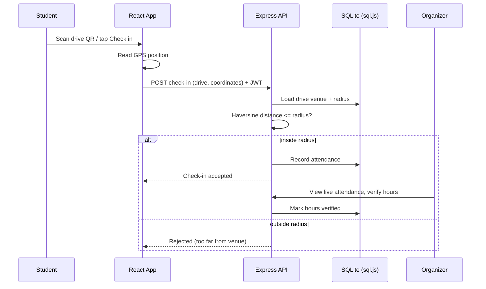
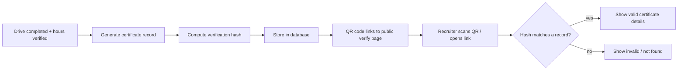
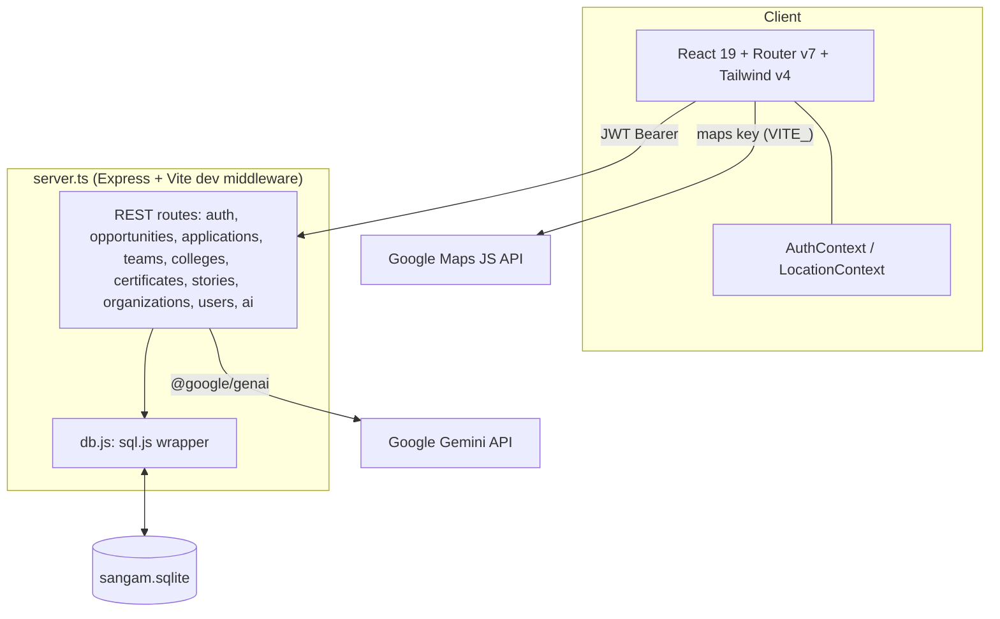
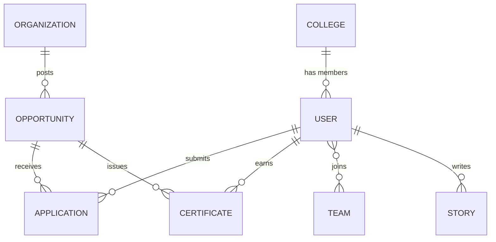

# Sangam (संगम) — Collegiate Volunteer & Internship Network 🇮🇳


**Sangam** (*Confluence*) connects college students with NGOs, community drives, and social internships across India. Students discover opportunities near campus, volunteer in campus squads, check in at the venue, and earn certificates that anyone can verify online. NGOs get a portal to post drives, screen applicants, and confirm attendance.

<!-- TODO: add a demo link and 2–3 screenshots/GIF here. This is the single biggest upgrade to this README. -->
<!-- **Live demo:** https://... -->
<!--  -->

---

## Table of Contents

- [Why Sangam](#why-sangam)
- [Features](#features)
- [User Roles & Flows](#user-roles--flows)
- [How It Works](#how-it-works)
- [Architecture](#architecture)
- [Tech Stack](#tech-stack)
- [Getting Started](#getting-started)
- [Environment Variables](#environment-variables)
- [Project Structure](#project-structure)
- [API Overview](#api-overview)
- [Data Model](#data-model)
- [Seed Data](#seed-data)
- [Scripts](#scripts)
- [Security & Data](#security--data)
- [Known Limitations](#known-limitations)
- [Troubleshooting](#troubleshooting)
- [Roadmap](#roadmap)
- [Contributing](#contributing)
- [License](#license)

---

## Why Sangam

Student volunteering in India is scattered across WhatsApp groups, posters, and word of mouth. That causes three recurring problems:

1. **Discovery:** students don't know which NGOs or drives are near their campus.
2. **Trust:** NGOs can't easily confirm who actually showed up, and students can't easily prove their hours.
3. **Recognition:** certificates are paper or PDF files that are hard to verify and easy to fake.

Sangam puts discovery, attendance, and verification in one place, organized around the college chapter, since that's how students already form groups.

---

## Features

### 🎯 Opportunity discovery & geo-proximity matching
- **Domain filters:** Education, Healthcare, Environment & Sustainability, Animal Welfare, Rural Development, Women Empowerment, Disaster Relief.
- **Distance-aware browsing:** pick a campus preset (DU Delhi, VIT Vellore, COEP Pune, Jadavpur Kolkata, IISc/RV Bengaluru, Mumbai, Hyderabad) or use live GPS. Distances are computed with the Haversine formula (`src/utils`).
- **Interactive map:** event locations rendered with `@vis.gl/react-google-maps`.
- **Two opportunity types:** one-off community drives and longer social internships.

### 🤖 Google Gemini assistance
| Feature | What it does |
|---|---|
| **Opportunity recommendations** | Matches a volunteer's profile and skills to suitable drives |
| **SOP assistant** | Drafts a tailored motivation note / cover note for an internship application |
| **Impact summaries** | Turns logged contributions into resume-ready bullet points |

All Gemini calls go through the backend (`server/routes/ai.js`), so the API key never reaches the browser.

### 👥 Campus chapters & squads
- **College hubs:** students are grouped into their college network automatically at sign-up.
- **Squads:** form teams for large drives such as beach cleanups, teaching drives, and blood donation camps.
- **Leaderboards:** college-level ranking by total verified hours and Karma points.
- **Impact stories:** a community feed where completed drives are shared.

### 📱 Geofenced check-in & attendance
- Students check in via QR and GPS, and only when physically inside the drive's geo-radius.
- Organizers see check-ins live and verify hours on-site.
- Only verified hours count toward the leaderboard, Karma, and certificates.

### 📜 Verifiable digital certificates
- Issued when a drive is completed, with a verification hash stored alongside the record.
- Each certificate has a QR code linking to a public verification page, so employers, recruiters, and colleges can validate it in one click without logging in.

### 🏢 NGO & organization portal
- **Drive lifecycle:** create a drive, set volunteer caps, required skills, and venue coordinates, then close it and issue certificates.
- **Applicant screening:** review student portfolios, accept or reject, and assign team roles.
- **Attendance:** monitor live check-ins and confirm hours.

---

## User Roles & Flows

| Role | Can do |
|---|---|
| **Student volunteer** | Browse and filter drives, apply, join squads, check in, earn Karma and certificates, use AI tools, appear on leaderboards |
| **Organization (NGO)** | Post and manage drives, screen applicants, assign roles, verify attendance, issue certificates |
| **Public / recruiter** | Verify a certificate via its link or QR code (no account needed) |

**Typical volunteer journey**

1. Sign up, choose college, and get placed in the college hub.
2. Browse opportunities by domain and distance, then apply (optionally with an AI-drafted SOP).
3. Get accepted by the organizer and join or form a squad.
4. Check in on the day using QR + GPS.
5. Organizer verifies hours and closes the drive.
6. Certificate is issued, Karma and leaderboard rank update, and an AI impact summary can be generated.

---

## How It Works

### Geo-proximity & geofencing
Both features rely on the great-circle (Haversine) distance between two latitude/longitude points.

- **Discovery:** distance from the selected campus preset or live GPS position to each drive's venue, used for sorting and filtering.
- **Check-in:** a check-in is accepted only if the distance from the student's reported position to the venue is within the drive's allowed radius.

### Check-in flow



### Certificate verification



---

## Architecture



`server.ts` runs the API and the Vite dev server together on one port, so development needs a single command and no CORS setup between frontend and backend.

---

## Tech Stack

| Layer | Technology |
|---|---|
| **Frontend** | React 19, React Router v7, Tailwind CSS v4, Motion (Framer Motion), Lucide Icons |
| **UI extras** | Canvas Confetti, QRCode.react, `@vis.gl/react-google-maps` |
| **Backend** | Node.js, Express (REST) |
| **AI** | Google Gemini via `@google/genai` |
| **Database** | SQLite via `sql.js` (in-memory, persisted to `sangam.sqlite`, auto-seeded) |
| **Auth** | JWT (`jsonwebtoken`), `bcryptjs`, CORS |
| **Tooling** | Vite, TypeScript / `tsx`, PostCSS |

---

## Getting Started

### Prerequisites
- [Node.js](https://nodejs.org/) 18+ (20+ recommended)
- npm (or yarn / bun)
- A [Gemini API key](https://aistudio.google.com/) for the AI features
- *(Optional)* a Google Maps Platform key for map views

### Install & run

```bash
git clone https://github.com/samhitastuti/Sangam.git
cd Sangam
npm install
cp .env.example .env     # then fill in your keys (see below)
npm run dev
```

Open **http://localhost:3000**. On first run the database is created and seeded automatically.

<!-- TODO: list seeded demo accounts (one student, one organizer) so reviewers can try both roles immediately. -->

---

## Environment Variables

| Variable | Required | Used by | Description |
|---|---|---|---|
| `GEMINI_API_KEY` | For AI features | Server | Google Gemini key. Keep server-side only |
| `APP_URL` | Yes | Server | Base URL of the app (e.g. `http://localhost:3000`), used for links such as certificate verification |
| `VITE_GOOGLE_MAPS_API_KEY` | Optional | Browser | Enables map views. Restrict this key by HTTP referrer in Google Cloud |
<!-- TODO: if the server reads a JWT secret (e.g. JWT_SECRET), add a row for it here and in .env.example. -->

```env
GEMINI_API_KEY=your_gemini_api_key_here
APP_URL=http://localhost:3000
VITE_GOOGLE_MAPS_API_KEY=your_google_maps_api_key
```

> ⚠️ Never prefix `GEMINI_API_KEY` with `VITE_`. Vite exposes `VITE_*` variables in the browser bundle. Never commit `.env`.

---

## Project Structure

```text
├── public/                 # Static assets & icons
├── server/
│   ├── routes/             # Express route modules (see API Overview)
│   │   ├── ai.js           # Gemini endpoints (recommendations, SOP, summaries)
│   │   ├── auth.js         # Registration & JWT login
│   │   ├── applications.js # Volunteer applications
│   │   ├── certificates.js # Certificate issue & public verification
│   │   ├── colleges.js     # Campus directory & rankings
│   │   ├── opportunities.js# Drives & internships
│   │   ├── organizations.js# NGO profiles & management
│   │   ├── stories.js      # Community impact feed
│   │   ├── teams.js        # Squads & chapters
│   │   └── users.js        # Profiles & Karma
│   ├── db.js               # sql.js wrapper & query executor
│   ├── schema.sql          # Relational schema
│   └── seedExtended.js     # Seed data (10 Indian cities & NGOs)
├── src/
│   ├── components/         # Reusable UI (modals, nav, cards, QR)
│   ├── contexts/           # AuthContext, LocationContext
│   ├── pages/
│   │   ├── BrowsePage.jsx        # Discovery with filters & map
│   │   ├── OpportunitiesPage.jsx # Opportunity listing
│   │   ├── OpportunityPage.jsx   # Single drive: details, apply, check-in
│   │   ├── DashboardPage.jsx     # Volunteer dashboard
│   │   ├── OrgDashboardPage.jsx  # NGO dashboard
│   │   ├── CertificatePage.jsx   # Certificate view & verification
│   │   ├── LeaderboardPage.jsx   # College rankings
│   │   ├── ProfilePage.jsx       # Profile, Karma, AI summary
│   │   ├── StoriesPage.jsx       # Impact feed
│   │   └── LoginPage.jsx         # Sign in / sign up
│   ├── utils/              # Haversine distance, helpers, validators
│   ├── App.jsx             # Routing & providers
│   └── main.tsx            # React root
├── server.ts               # Unified dev & production server
├── vite.config.ts          # Vite config
└── package.json            # Dependencies & scripts
```

---

## API Overview

All routes are JSON REST endpoints. Protected routes need an `Authorization: Bearer <token>` header from login. Exact paths and payloads live in `server/routes/`; this table shows what each module is responsible for.

| Module | Responsibility |
|---|---|
| `auth.js` | Register users (student or organization) and log in; returns a JWT |
| `users.js` | Profile data, Karma points, volunteer hours |
| `opportunities.js` | List/filter drives and internships, create and update drives, venue and radius settings |
| `applications.js` | Apply to a drive, review applicants, accept/reject, assign roles |
| `teams.js` | Create and join squads, list college chapters |
| `colleges.js` | College directory and leaderboard rankings |
| `organizations.js` | NGO profiles and management |
| `certificates.js` | Issue certificates; public verification lookup by hash |
| `stories.js` | Community impact feed |
| `ai.js` | Gemini-backed recommendations, SOP drafting, impact summaries |

<!-- TODO: replace this table with exact method + path + auth rows once finalized, e.g. `POST /api/auth/login`. -->

---

## Data Model

Core entities (see `server/schema.sql` for exact columns and constraints):



<!-- TODO: verify entity and relationship names against schema.sql and adjust. -->

---

## Seed Data

On first start, `server/seedExtended.js` populates the database with:

- Colleges and campus locations across 10 Indian cities
- NGOs and organization profiles
- Sample volunteer and internship opportunities across the supported domains
- Verified volunteer stories for the community feed

To start fresh, stop the server, delete `sangam.sqlite`, and run `npm run dev` again to re-seed.

---

## Scripts

| Command | What it does |
|---|---|
| `npm run dev` | Starts the backend and Vite dev server together (`server.ts`) with HMR |
| `npm run build` | Builds production frontend assets to `/dist` |
| `npm run preview` | Previews the production build locally |
| `npm run lint` | Type-checks with `tsc --noEmit` |

---

## Security & Data

- **Passwords:** hashed with salted `bcryptjs`; never stored in plain text.
- **Auth:** stateless JWTs sent as `Bearer` tokens; protected routes verify the token on every request.
- **Secrets:** API keys live in `.env` (git-ignored). The Gemini key is used only on the server.
- **Persistence:** `sql.js` (WebAssembly SQLite) syncs to `sangam.sqlite` on disk. The first run creates the schema and seeds data.
- **Maps key:** `VITE_GOOGLE_MAPS_API_KEY` is public by nature; restrict it by HTTP referrer and enabled APIs in Google Cloud.

---

## Known Limitations

Sangam is a prototype. Before real-world use:

- **Storage:** `sql.js` holds the database in memory and writes snapshots to a file. It isn't suited to concurrent writes or multi-instance deployment. Move to PostgreSQL or native SQLite for production.
- **Geofencing:** GPS coordinates come from the client and can be spoofed. Treat check-ins as a deterrent, not proof; organizer verification is the real safeguard.
- **Certificates:** the verification hash confirms a certificate matches a record in Sangam's own database. It isn't an independent or blockchain-style proof.
- **AI output:** Gemini-generated SOPs and summaries are drafts. Users should review them before submitting.

---

## Troubleshooting

| Problem | Likely cause / fix |
|---|---|
| Port 3000 already in use | Stop the other process, or change the port in `server.ts` |
| Map is blank or shows an error | `VITE_GOOGLE_MAPS_API_KEY` is missing, invalid, or not allowed for your domain. Restart `npm run dev` after editing `.env` |
| AI features return errors | `GEMINI_API_KEY` is missing or invalid, or the key's quota is exhausted |
| Login fails after pulling new code | Schema may have changed. Delete `sangam.sqlite` and restart to re-seed |
| Check-in is rejected | You're outside the drive's geo-radius, or the browser denied location permission |
| `.env` changes not picked up | Restart the dev server; Vite reads env files at startup |

---

## Roadmap

- [ ] Move to a production database (PostgreSQL)
- [ ] Stronger check-in anti-spoofing (organizer-displayed rotating QR codes)
- [ ] Email / push notifications for acceptances and drive reminders
- [ ] Certificate PDF export
- [ ] Multi-language support (Hindi and regional languages)
- [ ] Admin panel for college coordinators
- [ ] Automated tests and CI

---

## Contributing

Issues and pull requests are welcome.

1. Fork the repo
2. Create a feature branch: `git checkout -b feature/your-feature`
3. Make your changes and run `npm run lint`
4. Commit: `git commit -m "Add your feature"`
5. Push: `git push origin feature/your-feature`
6. Open a Pull Request describing what changed and why

---

## License

Released under the **MIT License**.

<div align="center">
  <sub>Built with ❤️ for student volunteers across India.</sub>
</div>
